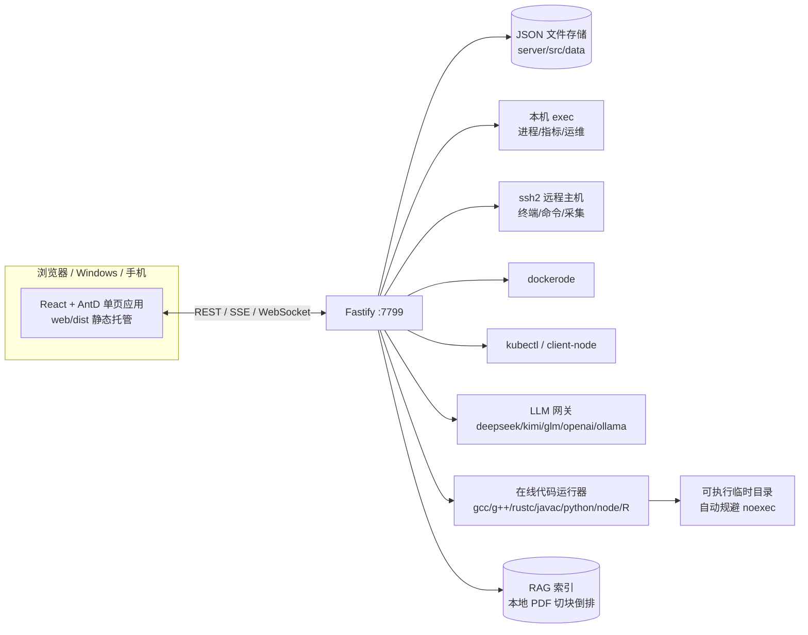

<div align="center">

# 轸宿智汇平台 · ZhenXiu ZH Platform

**轻量一体化「智能运维 · Agent 管理 · 在线编程」平台**

> 前身 Ops Hub — 用浏览器(手机/平板/Windows 均可)管理 Linux 主机的一站式控制台

[简体中文](#-项目简介) ｜ [功能特性](#-功能特性) ｜ [快速开始](#-快速开始) ｜ [配置](#-配置说明) ｜ [FAQ](#-faq) ｜ [Roadmap](#-roadmap)

   

</div>

---

## 📌 项目简介

轸宿智汇平台(英文名 **ZhenXiu ZH**,原 **Ops Hub**)是一套**开箱即用、单机部署**的一体化运维平台:

- 把 **本机 + 多台远程主机(Linux/VM)** 的 CPU / 内存 / 磁盘 / 负载 / 网络 / 进程 / 线程实时状态可视化;
- 通过 **WebSocket 终端 / 命令执行 / 系统运维抽屉** 直接对主机进行操作;
- 管理 **Docker、Kubernetes、常用中间件(30+ 组件一键 Docker 部署)**;
- 内置 **DevOps 流水线、监控告警(自动阈值)、AI 对话式运维、在线编程 + 力扣式题库、本地知识库 RAG**;

技术架构非常克制:**无需数据库、无需注册外部服务**,一份 Node.js 进程 + 目录下的 JSON 文件即可跑起来,适合作为个人/小团队的"中控面板",也适合学习全栈 + 运维自动化的代码样例。

> ⚠️ 本平台具备**高危执行能力**(可对主机执行命令、管理集群、部署容器),请务必**仅在内网/受信环境**使用,并按需开启鉴权层。

## ✨ 功能特性

| 模块 | 说明 |
| --- | --- |
| 📊 **总览 Dashboard** | 主机 / Agent / Docker / K8s / 工具 / 告警全局状态一屏尽览 |
| 🤖 **Agent 管理** | 扫描本机 pi / opencode 等 Agent 进程、模型、会话 |
| 🖥 **宿主机 / VM** | 多主机 CRUD、WebSocket 交互终端、命令执行、系统指标、SSH 密码/私钥/sudo、连接测试 |
| 🧰 **Linux 管理** | systemd 服务启停/自启、进程查看/结束、cron 在线编辑、监听端口 |
| 🐳 **Docker** | 容器/镜像/卷/网络管理、实时 stats、日志、一键启停删 |
| ☸️ **Kubernetes** | 集群看板(节点/命名空间/事件)、资源浏览、**Monaco 在线 YAML** 应用、伸缩/重启/日志、Pod 下钻 |
| ⚙️ **中间件 / 工具库** | 30+ 常见组件(MySQL/Redis/ES/Kafka/…),**未装给指引、装好自动识别**,多数支持**一键 Docker 部署** |
| 🚀 **DevOps 流水线** | 多步脚本/变量/失败策略、发布记录、脚本库、环境管理 |
| 📈 **监控 / 告警** | 主机指标**动态可视化**(动画仪表 + 近 48 次趋势)、CPU>90%/内存>90%/磁盘>80% 自动告警、事件流、进程→线程下钻 |
| 💬 **AI 智能运维** | SSE 流式对话,**自动调工具在主机上执行运维命令**(危险命令拦截);也支持通用问答/编程解答 |
| 🖊 **在线编程** | 本地编译/解释 8 种语言(C/C++/Rust/Java/Python/JS/TS/R),浏览器里写代码、喂 stdin、看输出 |
| 📚 **算法题库 + 解题页** | 随想录体系 37 题 / 13 类算法,力扣式界面:**左侧题目 + 右侧编辑器**,题解可看/可藏、含图解,一键运行 |
| 🧠 **本地知识库 RAG** | 离线扫描目录(PDF/TXT/MD)→ 切块 → 倒排索引 → AI 问答自动检索引用,**无需联网 embedding** |

## 🧱 技术栈

| 层 | 选型 |
| --- | --- |
| 后端 | Node.js(≥20)+ TypeScript + Fastify,端口 `7799`(可 `PORT` 覆盖) |
| 前端 | React 18 + Ant Design 5 + Vite,Monaco Editor(YAML/代码)、xterm.js(终端) |
| 存储 | 轻量 JSON 文件存储(`server/src/data/`,自动创建,**无需数据库**) |
| 连接 | 本机 `exec` / 远程 `ssh2` / `dockerode` / `kubectl`(@kubernetes/client-node)/ OpenAI 兼容 LLM |
| 图表 | 纯 SVG + CSS 动画,零额外依赖 |
| 常驻 | 可选 systemd(`start.sh`)或直接 `node` 运行 |

## 🏗 架构总览



## 🚀 快速开始

### 0. 环境要求

| 依赖 | 说明 | 是否必需 |
| --- | --- | --- |
| Node.js ≥ 20 | 运行后端 | ✅ 必需 |
| git / npm | 拉取与安装 | ✅ 必需 |
| gcc / g++ / python3 / node / java / rustc / Rscript 等 | 在线编程运行 | 按需(平台自动探测可用语言) |
| Docker | 容器与中间件一键部署 | 按需 |
| kubectl + kubeconfig(k3s 亦可) | Kubernetes 模块 | 按需 |

### 1. 拉取与安装

```bash
git clone <你的仓库地址> && cd <repo>
cd server && npm install && cd ..
cd web && npm install && cd ..
```

### 2. 启动

方式 A —— 开发模式(前端热更新,端口 `5173` 已代理 `/api` 到 `7799`):

```bash
cd server && npm run dev        # 后端 :7799
# 另开终端
cd web && npm run dev           # 前端 :5173
```

方式 B —— 生产模式(前端构建后由后端统一托管):

```bash
cd web && npm run build
cd server && npm run dev        # 或 pm2 / nohup / systemd 托管
# 打开 http://localhost:7799
```

方式 C —— systemd(本机已装好服务单元时):

```bash
./start.sh start     # 启动(日志 tail -f /tmp/opshub.log)
./start.sh status    # 状态
./start.sh logs      # 日志
./start.sh stop      # 停止
```

> 局域网/Windows 浏览器访问:`http://<服务器IP>:7799`(默认监听 `0.0.0.0`,可用 `HOST` 覆盖;请自行放行防火墙)。

### 3. 环境变量

| 变量 | 默认 | 说明 |
| --- | --- | --- |
| `PORT` | `7799` | 后端监听端口 |
| `HOST` | `0.0.0.0` | 监听地址 |
| `LOG` | `info` | Fastify 日志级别 |
| `OPSHUB_TMP` | 自动选择 | 在线编程临时目录(可执行);自动规避 `/tmp` 的 noexec 场景 |
| `KB_PATH` / 页面设置 | 可配 | 本地知识库根目录(可在「知识库 RAG」页修改并重建索引) |

## ⚙️ 配置说明

- **AI 对话**:自动读取本机 `~/.pi/agent/auth.json` 中已认证的 key(deepseek / kimi-coding / zai-coding-cn),也可在「AI 智能运维 → AI 设置」手动填 key / baseURL / model;支持 OpenAI 兼容厂商与本地 ollama。
- **监控告警**:在「监控/告警 → 监控配置」调整 CPU / 内存 / 磁盘阈值(默认 90 / 90 / 80),超阈值自动产生告警与事件。
- **知识库 RAG**:默认扫描 `~/Desktop/knowledge`(可用 `KB_PATH` 或页面设置覆盖);索引为纯本地倒排文件,**不依赖外部 embedding 服务**。
- **Kubernetes**:直接复用本机 kubectl 与 kubeconfig(含 `KUBECONFIG` 环境变量),可接 k3s/云集群。

## 📁 项目结构

```
.
├── server/                 # Fastify 后端
│   ├── src/
│   │   ├── index.ts        # 入口:路由注册、静态托管
│   │   ├── routes/         # hosts/docker/tools/k8s/ai/devops/monitoring/code/problems…
│   │   ├── lib/            # llm 网关、ssh/exec、代码运行器、JSON store…
│   │   ├── modules/        # kb(RAG)、tools(工具库探测/部署)…
│   │   └── data/           # 运行时数据(JSON + kb 缓存)——已被 .gitignore,勿提交
│   └── package.json
├── web/                    # React 前端
│   ├── src/pages/          # 各功能页(含 problems 题库列表、Solve 力扣式解题页)
│   ├── src/components/     # 终端、Markdown、AI 助手等
│   └── package.json
├── problems/               # 算法题库静态资源(可扩展:放 .md + 登记 index.json)
├── start.sh                # systemd 辅助脚本(可选)
└── README.md
```

## ➕ 扩展题库

题库是**纯静态资源**,非常易于扩展:

```bash
# 1. 在 problems/ 任意子目录新增 <id>.md
#    格式:题目描述…<!-- @题解 -->题解/图解/参考代码(可看/可藏)
# 2. 在 problems/index.json 的 problems 数组追加一条 {id,title,no,category,difficulty,tags,…}
```

平台会在 `/problems`、`/solve/:id` 自动发现并展示。

## 📸 截图

> 截图示例(可选):把图片放到 `docs/screenshots/` 后替换以下链接即可。

- 总览 Dashboard
- 监控/告警 → 主机指标(动态仪表 + 趋势)
- 在线编程 + 力扣式解题页
- AI 智能运维对话

## ❓ FAQ

<details>
<summary><b>1. 在线编程“运行失败”,编译产物无权限?</b></summary>

若系统把 `/tmp` 挂成 `noexec`(加固环境常见),编译后的二进制无法执行。平台启动时会自动探测并选用可执行目录(`/var/tmp`、`/dev/shm`、项目内 `.runtmp`),也可显式 `OPSHUB_TMP=/your/executable/dir` 指定。
</details>

<details>
<summary><b>2. Docker 拉镜像报 EOF / 拉不下来?</b></summary>

网络原因(墙/代理策略)。推荐在 `/etc/docker/daemon.json` 配置可用 registry 镜像源(如 `docker.1ms.run` 等),重启 docker 后再部署。
</details>

<details>
<summary><b>3. AI 提示“连接中断 / 未配置 Key”?</b></summary>

进入「AI 智能运维 → AI 设置」检查 provider 的 key/baseURL;若本机装有 pi/opencode,平台也会自动复用 `~/.pi/agent/auth.json` 的认证。
</details>

<details>
<summary><b>4. 迁移/换机器后“数据读不到”?</b></summary>

所有路径均基于运行模块相对推导(`server/src/data`、`problems`),把整个项目目录拷贝到新机器即可;知识库扫描目录与代码临时目录都可用环境变量/页面配置调整,不会因绝对路径丢失而出错。
</details>

<details>
<summary><b>5. 会把我的数据/密钥传到 GitHub 吗?</b></summary>

不会。`.gitignore` 已排除 `server/src/data/`(含 settings/AI key/监控数据与知识库缓存)、`.runtmp`、`node_modules`、`web/dist` 等。请勿手动 `git add -f` 提交上述目录。
</details>

## 🤝 参与贡献

欢迎 Issue 与 PR:

- 提需求/报 Bug:请附浏览器与后端日志(`/tmp/opshub.log`)片段。
- 代码风格:TypeScript、Fastify 路由注册在 `server/src/index.ts` 统一完成;前端保持 AntD 浅色风格。
- 新增题库 / 工具模板 / 采集指标,均有清晰的扩展点。

## 🗺 Roadmap

- [ ] 登录 / 多用户与操作审计(高危命令二次确认)
- [ ] 指标存储历史化 + 趋势拉长(按天归档)
- [ ] 通知渠道(钉钉/飞书/邮件/Webhook)告警
- [ ] 代码运行沙箱化(容器/隔离)
- [ ] OpenAPI 导出与 CLI

## 📄 License

[MIT](LICENSE) © 轸宿智汇平台贡献者
